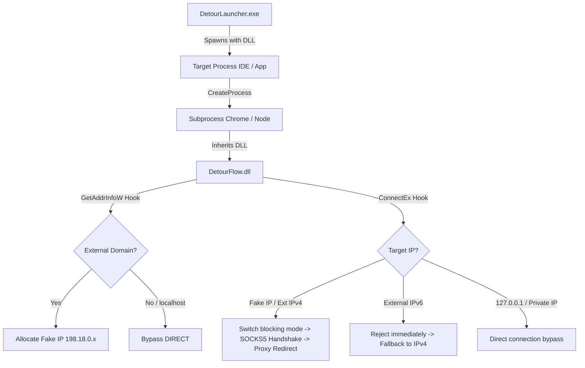

# DetourFlow 🚀

[](https://www.microsoft.com/windows)
[](https://en.cppreference.com/w/cpp/compiler_support)
[](LICENSE)
[](https://github.com/civilization-os/DetourFlow/stargazers)

`DetourFlow` is a non-intrusive, **process-level TCP/IP traffic redirector** for Windows. 

Leveraging the **Microsoft Detours** library, it injects a custom DLL into target processes to transparently intercept Winsock calls (`connect`, `ConnectEx`, `GetAddrInfoW`, etc.). It seamlessly routes external internet traffic to a local SOCKS5 proxy (e.g., Clash / V2Ray on `127.0.0.1:7897`), while allowing loopback, local area network (LAN), and private network connections to pass through directly.

---
👉 **[中文版使用说明 (Chinese Version)](#-中文使用说明)**
---


## ✨ Features

- 🎯 **Process-Level Sandbox Isolation**: No TUN/TAP virtual network adapters or global routing changes required. Interception is strictly confined to the targeted process and its descendants.
- ⚡ **IPv6 Happy Eyeballs Fallback**: Automatically intercepts external IPv6 connection attempts (e.g. Chrome's DoH connection to `[2001:4860:4860::8888]`) and immediately rejects them with `WSAENETUNREACH`. This forces dual-stack applications to instantly fall back to IPv4 and traverse through the SOCKS5 proxy without hanging.
- 🛡️ **Chrome Sandbox Auto-Bypass**: Intercepts process creation API (`CreateProcessA/W`) and appends `--no-sandbox` to any `chrome.exe` command lines. This ensures the DLL can load successfully in Chrome's sandboxed network utility subprocesses and keep hooks active.
- 🔌 **Proxy Loopback Avoidance**: Automatically sets `no_proxy`/`NO_PROXY` environment variables to `localhost,127.0.0.1,::1` in DLL attach. This prevents child processes (like `curl` or Playwright WebSocket) from attempting to route local loopback control traffic (e.g., debugging port `9222`) through the SOCKS5 proxy.
- 📝 **Stream-Friendly Clean Logs**: Redirects all logging outputs to files and debug streams (`OutputDebugStringA`), keeping `stdout`/`stderr` completely untouched. This is perfect for Model Context Protocol (MCP) servers or node pipelines communicating via standard streams.

## 🛠️ Architecture



## 🏗️ Build Guide

### Prerequisites
- Visual Studio 2022 (with "Desktop development with C++")
- CMake (version >= 3.15)

### Steps
Run the following commands in PowerShell from the project root:

```powershell
# Create build directory
mkdir build
cd build

# Configure CMake (automatically downloads and builds Microsoft Detours dependency)
cmake .. -DCMAKE_BUILD_TYPE=Release

# Build project
cmake --build . --config Release
```

The compiled binaries will be output to `build/Release/`:
- `DetourFlow.dll`: The core hooking library.
- `DetourLauncher.exe`: The process launcher that injects the library.

## 🚀 Quick Start (For Release Users)

No compilation is needed! Follow these steps to get started:

1. **Download**: Go to the [Releases](https://github.com/civilization-os/DetourFlow/releases) page and download `DetourFlow-v1.0.0-win-x64.zip` (or download `DetourLauncher.exe` and `DetourFlow.dll` directly).
2. **Extract**: Extract the zip contents into any folder of your choice. Ensure that `DetourLauncher.exe` and `DetourFlow.dll` are in the **same** directory.
3. **Run**: Open PowerShell or Command Prompt, navigate to the extracted folder, and run your target application using the launcher:
   ```powershell
   # Syntax
   .\DetourLauncher.exe "<path-to-target-executable>" [arguments...]

   # Example: Launch Antigravity IDE (Replace 'YourUsername' with your Windows username)
   .\DetourLauncher.exe "C:\Users\YourUsername\AppData\Local\Programs\Antigravity IDE\Antigravity IDE.exe"
   ```

### ⚙️ Configuring SOCKS5 Proxy Port
By default, `DetourFlow` routes traffic to Clash on `127.0.0.1:7897`. 
If your local SOCKS5 proxy is running on a different port (e.g. Clash on `7890`), set the following environment variables in your PowerShell terminal before running the launcher:

```powershell
# Set proxy address (Default is 127.0.0.1)
$env:DETOUR_PROXY_HOST="127.0.0.1"

# Set SOCKS5 proxy port (e.g. 7890)
$env:DETOUR_PROXY_PORT="7890"

# Now run the launcher
.\DetourLauncher.exe "C:\Users\YourUsername\AppData\Local\Programs\Antigravity IDE\Antigravity IDE.exe"
```

---

## 🇨🇳 中文使用指引 (Release 快速开始)

如果您直接从 Release 页面下载了编译好的版本，**无需自行编译**。请按以下步骤运行：

1. **下载**: 前往 [Releases](https://github.com/civilization-os/DetourFlow/releases) 页面下载 `DetourFlow-v1.0.0-win-x64.zip`（或者直接下载 `DetourLauncher.exe` 和 `DetourFlow.dll`）。
2. **解压**: 将压缩包解压至任意目录，**确保 `DetourLauncher.exe` 与 `DetourFlow.dll` 放置在同一个文件夹内**。
3. **运行**: 打开 PowerShell 或 CMD 终端，进入解压后的目录，使用启动器拉起您想要代理的目标程序：
   ```powershell
   # 语法
   .\DetourLauncher.exe "<目标程序绝对路径>" [程序参数...]

   # 实例：分流模式启动 Antigravity IDE (请将 YourUsername 替换为您自己的 Windows 用户名)
   .\DetourLauncher.exe "C:\Users\YourUsername\AppData\Local\Programs\Antigravity IDE\Antigravity IDE.exe"
   ```

### ⚙️ 修改本地代理端口
项目默认将网络请求转发至本地的 Clash 端口 `127.0.0.1:7897`。
如果您本地的 SOCKS5 代理运行在其他端口（例如 `7890`），请在拉起程序前，在 PowerShell 终端中临时设置以下环境变量：

```powershell
# 临时指定代理端口为 7890
$env:DETOUR_PROXY_PORT="7890"

# 运行启动器
.\DetourLauncher.exe "C:\Users\YourUsername\AppData\Local\Programs\Antigravity IDE\Antigravity IDE.exe"
```

### 🛠️ 工作原理
1. **进程级沙箱分流**：无需配置 TUN/TAP 虚拟网卡，只针对注入的进程及其派生的整个进程链条做流量代理。
2. **IPv6 零延迟快速失败**：拦截所有外部 IPv6 连接并立即返回不可达，强制双栈程序（如 Chrome）瞬间回退到 IPv4 以走 SOCKS5 代理，避免了网络长连接超时挂起。
3. **沙箱自动规避**：拦截 `CreateProcess` 并在检测到 `chrome.exe` 时自动追加 `--no-sandbox` 启动参数，确保 Chrome 浏览器网络进程能顺利加载 DLL 和生效 Hook。
4. **回环代理过滤**：自动设置进程环境变量中的 `no_proxy`/`NO_PROXY` 绕过对本机 `127.0.0.1` 调试端口的劫持，避免因代理软件阻断回环通信导致的 AI 与浏览器交互超时。
5. **不污染标准输出**：日志仅输出到调试器（Debug String）和本地文件，不占用 `stdout`/`stderr`，保证 MCP 服务基于标准输出进行 JSON-RPC 通信的纯净度。

---

## 📄 License

This project is licensed under the [MIT License](LICENSE).
