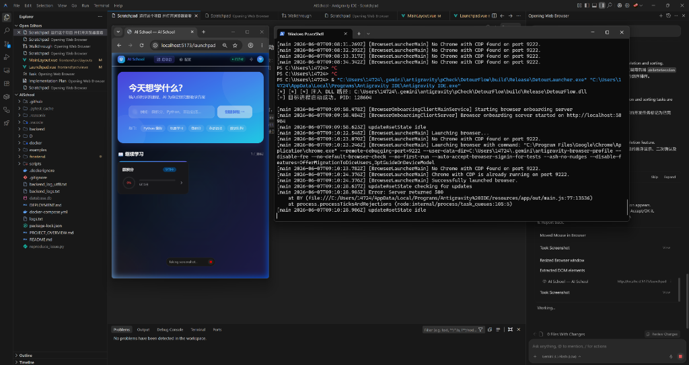
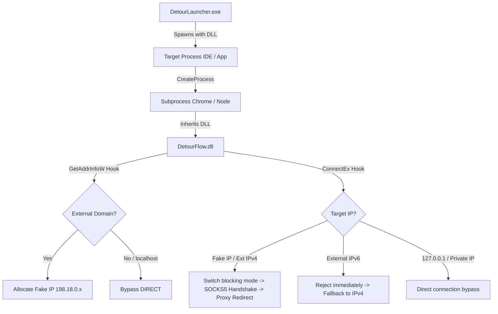

# DetourFlow 🚀

[](https://www.microsoft.com/windows)
[](https://en.cppreference.com/w/cpp/compiler_support)
[](LICENSE)
[](https://github.com/civilization-os/DetourFlow/stargazers)

`DetourFlow` is a non-intrusive, **process-level TCP/IP traffic redirector** for Windows. 

Leveraging the **Microsoft Detours** library, it injects a custom DLL into target processes to transparently intercept Winsock calls (`connect`, `ConnectEx`, `GetAddrInfoW`, etc.). It seamlessly routes external internet traffic to a local SOCKS5 proxy (e.g., Clash / V2Ray on `127.0.0.1:7897`), while allowing loopback, local area network (LAN), and private network connections to pass through directly.

---
👉 **[中文版使用说明 (Chinese Version)](#-中文使用说明)**
---



## ✨ Features

- 🎯 **Process-Level Sandbox Isolation**: No TUN/TAP virtual network adapters or global routing changes required. Interception is strictly confined to the targeted process and its descendants.
- ⚡ **IPv6 Happy Eyeballs Fallback**: Automatically intercepts external IPv6 connection attempts (e.g. Chrome's DoH connection to `[2001:4860:4860::8888]`) and immediately rejects them with `WSAENETUNREACH`. This forces dual-stack applications to instantly fall back to IPv4 and traverse through the SOCKS5 proxy without hanging.
- 🛡️ **Chrome Sandbox Auto-Bypass**: Intercepts process creation API (`CreateProcessA/W`) and appends `--no-sandbox` to any `chrome.exe` command lines. This ensures the DLL can load successfully in Chrome's sandboxed network utility subprocesses and keep hooks active.
- 🔌 **Proxy Loopback Avoidance**: Automatically sets `no_proxy`/`NO_PROXY` environment variables to `localhost,127.0.0.1,::1` in DLL attach. This prevents child processes (like `curl` or Playwright WebSocket) from attempting to route local loopback control traffic (e.g., debugging port `9222`) through the SOCKS5 proxy.
- 📝 **Stream-Friendly Clean Logs**: Redirects all logging outputs to files and debug streams (`OutputDebugStringA`), keeping `stdout`/`stderr` completely untouched. This is perfect for Model Context Protocol (MCP) servers or node pipelines communicating via standard streams.

## 🛠️ Architecture



## 🏗️ Build Guide

### Prerequisites
- Visual Studio 2022 (with "Desktop development with C++")
- CMake (version >= 3.15)

### Steps
Run the following commands in PowerShell from the project root:

```powershell
# Create build directory
mkdir build
cd build

# Configure CMake (automatically downloads and builds Microsoft Detours dependency)
cmake .. -DCMAKE_BUILD_TYPE=Release

# Build project
cmake --build . --config Release
```

The compiled binaries will be output to `build/Release/`:
- `DetourFlow.dll`: The core hooking library.
- `DetourLauncher.exe`: The process launcher that injects the library.

## 🚀 Usage

Launch the target application using the launcher. The command-line arguments will be transparently forwarded to the target process:

```powershell
# Syntax
.\DetourLauncher.exe "<path-to-target-executable>" [arguments...]

# Example: Run Antigravity IDE under the proxy redirector
& ".\DetourLauncher.exe" "C:\Users\14724\AppData\Local\Programs\Antigravity IDE\Antigravity IDE.exe"
```

### ⚙️ Customizing Proxy Server (Optional)
By default, the proxy targets Clash on `127.0.0.1:7897`. You can customize it by setting environment variables:

```powershell
$env:DETOUR_PROXY_HOST="127.0.0.1"
$env:DETOUR_PROXY_PORT="7890"  # Set to your SOCKS5 proxy port
```

---

## 🇨🇳 中文使用说明

`DetourFlow` 是基于 **Microsoft Detours** 实现的非侵入式 **Windows 进程级网络流量分流控制器**。

它通过 DLL 注入拦截目标进程链的 Winsock 网络套接字函数调用，自动将外部网络流量同步重定向到您指定的本地 SOCKS5 代理端口（默认 `127.0.0.1:7897`），并自动放行本地回环、内网和私有网段流量。

### 🛠️ 工作原理
1. **进程级沙箱分流**：无需配置 TUN/TAP 虚拟网卡，只针对注入的进程及其派生的整个进程链条做流量代理。
2. **IPv6 零延迟快速失败**：拦截所有外部 IPv6 连接并立即返回不可达，强制双栈程序（如 Chrome）瞬间回退到 IPv4 以走 SOCKS5 代理，避免了网络长连接超时挂起。
3. **沙箱自动规避**：拦截 `CreateProcess` 并在检测到 `chrome.exe` 时自动追加 `--no-sandbox` 启动参数，确保 Chrome 浏览器网络进程能顺利加载 DLL 和生效 Hook。
4. **回环代理过滤**：自动设置进程环境变量中的 `no_proxy`/`NO_PROXY` 绕过对本机 `127.0.0.1` 调试端口的劫持，避免因代理软件阻断回环通信导致的 AI 与浏览器交互超时。
5. **不污染标准输出**：日志仅输出到调试器（Debug String）和本地文件，不占用 `stdout`/`stderr`，保证 MCP 服务基于标准输出进行 JSON-RPC 通信的纯净度。

### 🏗️ 编译与运行
请参考上文 [Build Guide](#-build-guide) 与 [Usage](#-usage) 英文指引。

---

## 📄 License

This project is licensed under the [MIT License](LICENSE).
