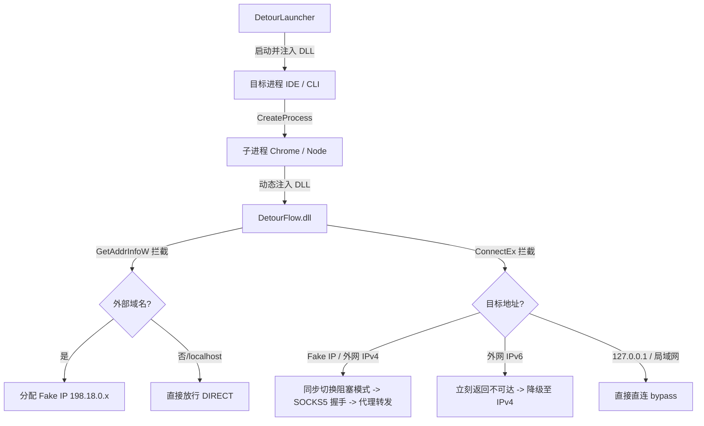

# DetourFlow 🚀

`DetourFlow` 是一个运行于 Windows 平台的**非侵入式进程级网络流量分流控制器**。

项目利用 **Microsoft Detours** 库，通过动态链接库（DLL）注入的方式，透明拦截目标进程及其子进程的 Winsock 套接字调用（如 `connect`, `ConnectEx`, `GetAddrInfoW` 等），将外部网络流量同步重定向到指定的本地 SOCKS5 代理（例如 Clash / V2Ray 的 `127.0.0.1:7897`），同时放行所有本地回环、局域网及私有网段流量。

## 🌟 核心特性

- 🎯 **进程级网络沙箱隔离**：无需开启系统级 TUN 模式或虚拟网卡，仅针对目标进程及其派生的整个进程链条进行精准流量劫持。
- ⚡ **双栈支持与 Happy Eyeballs 降级**：
  - 支持原生 IPv4 流量的 Fake IP 映射与 SOCKS5 握手。
  - **IPv6 零延迟快速失败**：对目标进程的外部 IPv6 连接请求立即返回 `WSAENETUNREACH` 错误，强制双栈应用（如 Chrome）瞬间触发系统级回退至 IPv4，完美解决非 TUN 环境下 IPv6 请求卡死超时（通常挂起 21s）的问题。
- 🛡️ **沙箱自动规避 (Chrome Sandbox Bypass)**：
  - 自动拦截进程创建 API (`CreateProcessA/W`)，当检测到目标为 `chrome.exe` 时动态注入 `--no-sandbox` 启动参数。
  - 攻克了 Chrome 浏览器网络子进程（Network Service）在沙箱约束下无法加载 Hook DLL、无法执行 Winsock Hook 的顽疾。
- 🔌 **回环自适应与代理环路规避**：
  - 自动向目标进程及其所有派生进程注入 `no_proxy`/`NO_PROXY` 本地旁路环境变量（`localhost,127.0.0.1,::1`）。
  - 防止被代理进程使用 `curl` 或 WebSocket 探测本地 CDP 调试端口（如 `9222`）时，连接被外部代理软件拦截而导致握手失败。
- 📝 **精简无干扰日志**：
  - 完全重定向日志输出至文件与 Windows 调试流（`OutputDebugStringA`），**绝不占用和污染进程的标准输出（stdout/stderr）**，完美支持基于标准流通信的 MCP（Model Context Protocol）服务与命令行管道工具。

## 🛠️ 工作原理



## 🏗️ 编译指南

### 前置条件
- Visual Studio 2022 (包含 C++ 桌面开发工作负载)
- CMake (版本 >= 3.15)

### 编译步骤
在项目根目录下打开 PowerShell 执行以下命令：

```powershell
# 创建并进入构建目录
mkdir build
cd build

# 配置 CMake 项目 (自动拉取并集成 Detours 依赖)
cmake .. -DCMAKE_BUILD_TYPE=Release

# 编译项目
cmake --build . --config Release
```
编译完成后，你将在 `build/Release/` 目录下得到以下产物：
- `DetourFlow.dll`：核心劫持 Hook 动态链接库。
- `DetourLauncher.exe`：启动器，用于拉起目标程序并注入上述 DLL。

## 🚀 使用方法

通过启动器直接拉起你想要代理的 Windows 应用程序，可执行文件后的参数会自动透明传递：

```powershell
# 语法
.\DetourLauncher.exe "<目标程序路径>" [目标程序启动参数...]

# 示例：以代理分流模式拉起 Antigravity IDE
& ".\DetourLauncher.exe" "C:\Users\14724\AppData\Local\Programs\Antigravity IDE\Antigravity IDE.exe"
```

### ⚙️ 环境变量配置（可选）
默认重定向到本地 Clash 代理端口 `127.0.0.1:7897`。你可以通过设置环境变量自定义代理服务器地址：

```powershell
$env:DETOUR_PROXY_HOST="127.0.0.1"
$env:DETOUR_PROXY_PORT="7890"  # 更改为你本地的 SOCKS5 代理端口
```

## 📄 开源协议

本项目采用 [MIT License](LICENSE) 开源协议。
